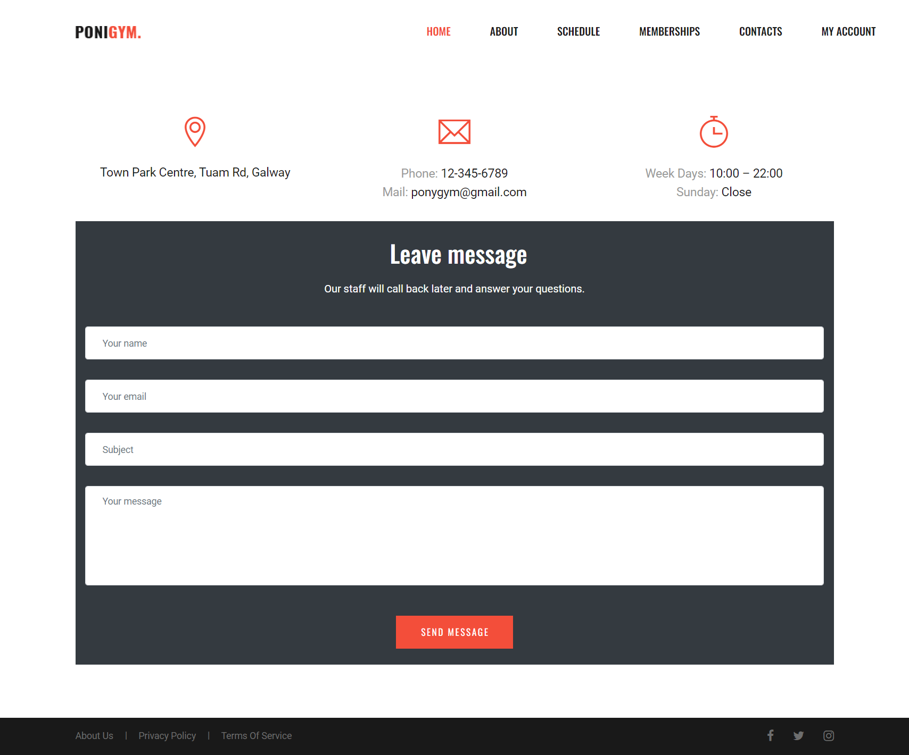

README Table Content

- [**Project Introduction**](#project-introduction)
- [**UX (User Experience)**](#ux-user-experience)
  - [**User Stories**](#user-stories)
  - [**Agile Tools**](#agile-tools)
- [**Design & Site architecture**](#design-and-architecture)
- [**Features**](#features)
  - [**Navbar**](#navbar)
  - [**Footer**](#footer)
  - [**Landing Page**](#landing-page)
  - [**About Page**](#about-page)
  - [**Schedule Page**](#schedule-page)
  - [**Memberships Page**](#memberships-page)
  - [**Contacts Page**](#contacts-page)
  - [**Login Page**](#login-page)
  - [**Logout Page**](#logout-page)
- [**Stripe Payments**](#stripe-payments)
- [**Marketing and SEO**](#marketing-seo)
- [**Facebook Page**](#facebook-page)
    - [**sitemap.xml**](#sitemapxml)
    - [**robots.txt**](#robotstxt)
- [**Technologies used**](#technologies-used)
  - [**Languages**](#languages)
  - [**Frameworks and Libraries**](#frameworks)
  - [**Programs & Tools**](#programs-and-tools)
- [**Testing**](#testing)
- [**Deployment**](#deployment)
- [**Credits**](#credits)
  - [**Code**](#code)
  - [**Content**](#content)
  - [**Media**](#media)
  - [**Inspiration**](#inspiration)
  - [**Acknowledgments**](#acknowledgments)

*****

# Project Introduction

This is the project milestone 5 for Code Institute Full-stack development program: Software Development (E-commerce Applications) .
PONIGYM is an  E-commerce application where users can find and buy желаемые services. 
PONIGYM is a fictional fitness club. It is designed to be responsive and accessible on a variety of devices for the ease of use of the site by potential users.

The deployed [PONIGYM](https://fitclub.herokuapp.com/) app.

The [GitHub repository](https://github.com/LarisaLG/fitness_club)

### UX (User Experience)
### User Stories

As a first time visitor, I want:

* to easily understand the main purpose of the site,
* to be able to easily navigate throughout the site,
* to register for an account to avail of the services offered to members,
* to be able to log out of my user account.
       
As a website user, I can:

* to navigate around the site and easily view the desired content,
* to view a list of services and choose accordingly,
* to buy a product by using the website checkout system,
* to sign in to my user account,
* to edit my account details or delete them,
* to sign out of my account to keep my account safe.

As a Site Administrator I would like to be able:

* to create, view, edit and delete services data   
* to create a new user, to delete user, to create and delete services,
* to change a user’s permissions on the website

### Agile tools

The GitHub Projects section was used as a [Kanban board](https://github.com/users/LarisaLG/projects/18/views/1) for the development of this project, which made it possible to break down the project execution into subtasks and make it easier to complete and track project progress.
[User stories](https://github.com/LarisaLG/fitness_club/issues) were used to break down the project into sub-tasks and placed on the Kanban board to work on them and track progress.

[Back to the top](#table-of-contents)

## Design and Site architecture

The site is made using the [Colorlib](https://colorlib.com) template.
Logo, images, color scheme, font for site were used from the specified template.

### Site architecture
PONIGYM diagram:

[Back to the top](#table-of-contents)

## Features
### Navbar
The navigation bar is present on all pages of the site. The navigation bar changes depending on whether the user is the gym member or a trainer.
Also, the navigation bar is an adaptive element, and on mobile screens it collapses into a hamburger block.

 ### Footer

 On the website footer, users can see map and gym location information. Footer contains form to request call back. privacy policy,links to social media. Also footer includes links to informattion about Ponigym,privacy policy and links to social media.

[Back to the top](#table-of-contents)

### Landing Page
The Home page works as a landing page, where the user sees background banner with a description of the services and the text of the slogan and call to action button.
There are also sections with a brief description of programs and classes.

### About Page

The About page contains a Welcome section and a section of Our Trainers.

[Back to the top](#table-of-contents)

### Schedule Page
On the Schedule page, the user has access to the schedule of all classes or he can filter the classes by selecting them from the submenu.

### Memberships Page
On the Membership page, the user can see packages, package details, their cost and go to the checkout page.

[Back to the top](#table-of-contents)

### Checkout Page
On the Checkout page, the user can see the package he has chosen and the details of the package, and the total amount.
Also, the User has 2 buttons available where he can go directly to payment or go back to select another service.

### Contacts Page
The contact page contains contact information, club opening hours and a contact form for feedback.

[Back to the top](#table-of-contents)

### Sign Up Page
The Sign Up page contains a form with fields for entering email, username,name, surname and password. For registered users there is a link to enter the account.

### Login Page
The Login page contains a form with fields for entering userneme or email, name, and password. For unregistered users, there is a link to register an account.

### Logout Page
Logout page: Logging out of the account is done through the menu, after which the user is redirected to the logout page where he must confirm his desire to log out of the account. After a successful logout, the user is returned to the home page and receives a message at the top of the screen.

[Back to the top](#table-of-contents)

## Future feature
Due to lack of time, this project was created as an MVP and there are many features left that were not included in the project. In the future, for the convenience of the user, you need to add the following features:
* return arrow to the top,
*in the user's profile, add a section with information about purchased subscriptions,
* page with information about the trainer, specialty and certificates
* give the coach the opportunity to edit the schedule of their classes

## MARKETING and SEO

Marketing strategy and SEO are very important parts of a B2C e-commerce business. To do this, the site has integrated a newsletter subscription form and created a Facebook business page to attract new customers to the site.

Facebook page

 

The newsletter subscription is linked to Mailchimp, allowing you to effectively manage your marketing campaigns and your subscribers.

Mailchimp dashboard

In order to promote the site and improve its finding by search engines, I added metadata (description, keywords) and a title in the head of the base.html page.

### sitemap.xml
For better processing of the site by search engines and their understanding of the structure of the site in the root folder of the project
added a sitemap file with a list of important URLs,

### robots.txt
The robots.txt file is needed to tell search engines which files should not be crawled and should not be indexed.

[Back to the top](#table-of-contents)

## Technologies Used

### Languages
  - Python
  - JavaScript
  - HTML5
  - CSS3

### Frameworks, Libraries, Programs

  - [Django](https://www.djangoproject.com/): python framework used to create all the backend 

### Database:
  - [PostgreSQL](https://www.postgresql.org/): the database used to store all the data.

### Programs & Tools

- [Google Fonts:](https://fonts.google.com/) Was used to to incorporate font styles.  
- [Font Awesome](https://fontawesome.com/): was used to create the icons used on the website.
- [Bootstrap](https://getbootstrap.com/) Was used to create the front-end design.
- [Gitpod:](https://Gitpod.io/) Gitpod was used as IDE to commit and push the project to GitHub.
- [GitHub:](https://github.com/) Was used as a version control system to manage the code
- [Figma:](https://www.figma.com/) Was used to create wireframes
- [TinyPNG:](https://tinypng.com/) Was used to reduce the size and weight of images and optimizing interaction with the site 
- [Am I Responsive](http://ami.responsivedesign.is/) to generate an image showcasing the website's responsiveness to different screen sizes 
- [Pip3](https://pypi.org/project/pip/): is the package manager to install Python modules and libraries.
- [Gunicorn](https://docs.djangoproject.com/en/4.1/howto/deployment/wsgi/gunicorn/): "Green Unicorn" is a Python Web Server Gateway to translate HTTP Requests for Python to understand.
- [Psycopg2](https://pypi.org/project/psycopg2/): PostgreSQL database adapter so I can manage the Database in Python. 
- [Allauth](https://django-allauth.readthedocs.io/en/latest/installation.html) for authentication, registration and account management
- [Stripe](https://pypi.org/project/stripe/) for processing all online and credit card purchases on the website
- [Crispy Forms](https://django-crispy-forms.readthedocs.io/en/latest/) to style the forms
- [AWS](https://aws.amazon.com/) was used to host the static files and media
- [Heroku](https://dashboard.heroku.com/): the hosting service used to host the website.
- [Chrome Developer Tools](https://developer.chrome.com/docs/devtools/open/): was used to debug the website.
- [Github Projects and Kanban board](https://github.com/users/LarisaLG/projects/18/views/1) was used to track the progress of the project in general and of every application in the project.
- [Free grammar checker](https://www.zoho.com/writer/free-grammar-checker.html)

## Credits
### Code

The article [**Using SCSS/SASS with Django3**](https://medium.com/@taylorberukoff/using-scss-sass-with-django3-d0930936610c) helped me set up SCSS in my project.

The code from the CI walthrough project Boutique Ado project was also used to create this project.

### Content

  - [**Media**](#media)
  - [**Inspiration**](#inspiration)

## Acknowledgments

To cohort facilitator Kasia Bogucka for constant support and faith in success under any circumstances.
Tutor support group Code Institute. Irene Neville who kept me in good shape and didn't let me stop.

[Back to the top](#table-of-contents)